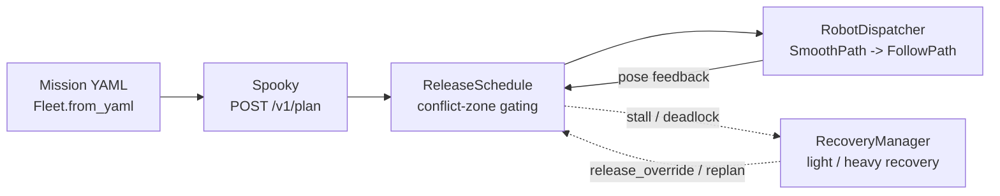

# fleet-coordinator

A decoupled multi-robot fleet coordinator for ROS2/nav2. Calls Spooky (a
quantum/classical global multi-robot path planner, see **Prerequisites**
below) once for the whole fleet, turns its symbolic-step ordering into a
conflict-zone release schedule per robot, and hands each robot's
currently-released waypoints straight to nav2's own `FollowPath` — no
per-tick control, no MPC, no custom local planner. Each robot keeps its
own AMCL/costmap stack untouched; this package only decides *when* a
robot is allowed to drive the next stretch of its own path.

## Architecture



1. **Mission intake** (`robot.py`) — a `Robot` dataclass per robot
   (`start`/`goal` as a full `Pose2D` with heading, `priority`,
   `robot_radius`, `inflation`, `coordinate_format`), loaded from a
   mission YAML file (`Fleet.from_yaml`, see
   `config/mission.example.yaml`).
2. **Global planning** (`spooky_client.py`) — one `POST /v1/plan` call
   per planning cycle with every robot's spec in the same request. Gets
   back one discrete, symbolic-timestep path per robot.
3. **Release-gating** (`ordering.py`) — for every pair of robots, finds
   the contiguous bands where their paths come within combined effective
   radius (`robot_radius + inflation`), and holds the later-entering
   robot at the mouth of each shared band until the first has cleared it
   by a real distance margin. Most of a path has no conflict at all and
   releases immediately.
4. **Dispatch** (`dispatch.py`) — republishes each robot's
   currently-released path *prefix* as a new `FollowPath` goal each time
   it grows (a new goal preempts the in-flight one in place, so motion
   stays smooth except where a real conflict forces a wait). Every
   released path is smoothed via nav2's own `SmoothPath` action first —
   Spooky's raw grid output is full of near-90° corners that
   `RegulatedPurePursuitController` stalls/pivots on otherwise.
5. **Monitoring + recovery** (`monitoring.py`, `convergence.py`,
   `recovery.py`) — detects a fleet stalled clean at a mutual release
   gate or a controller-abort deadlock, and hands it to
   `RecoveryManager`: a light path (nudge just the contested robot clear,
   no replan) or a heavy path (yield the rest, replan the whole fleet
   from current poses) — see each module's own docstring for the
   mechanism.

Explicitly **not** this package's job: per-tick control, MPC solving,
localization/mapping, or joint/formation planning.

## Package layout

```
fleet-coordinator/
├── fleet_coordinator/
│   ├── robot.py             # Robot/Pose2D/Fleet -- mission intake
│   ├── spooky_client.py     # SpookySettings + POST /v1/plan client
│   ├── geometry.py          # shared 2D math (distance, heading, quaternion<->yaw)
│   ├── path_poses.py        # pure path/pose helpers dispatch.py builds on
│   ├── ordering.py          # OrderingConfig + ReleaseSchedule (conflict-zone gating)
│   ├── dispatch.py          # DispatchConfig + RobotDispatcher (SmoothPath -> FollowPath)
│   ├── monitoring.py        # Stall/Deadlock/ConvergenceConfig + pure detection logic
│   ├── convergence.py       # ConvergenceGate -- one-shot AMCL bootstrap
│   ├── recovery.py          # RecoveryConfig + RecoveryManager (deadlock recovery)
│   └── coordinator_node.py  # rclpy node wiring all of the above together
├── launch/coordinator.launch.py
├── config/
│   ├── mission.example.yaml   # example fleet mission
│   └── params.example.yaml    # example ROS2 parameter overrides
└── test/                     # see Testing, below
```

Every module not directly touching `rclpy` (`geometry.py`,
`path_poses.py`, `ordering.py`, `monitoring.py`, `recovery.py`) is
importable and unit-tested without ROS2 installed at all — the ROS-facing
pieces (`dispatch.py`, `convergence.py`, `coordinator_node.py`) are thin
wrappers around that pure logic.

## Prerequisites

- ROS2 (developed against Jazzy) with nav2 (`nav2_msgs`, `tf2_ros`) and
  the usual per-robot AMCL + `controller_server`/`smoother_server` stack
  already running for each robot — this package coordinates them, it
  doesn't launch or configure them.
- A reachable Spooky server (`spooky.base_url`, default
  `http://localhost:8000`) exposing `POST /v1/plan`.

## Install

```bash
cd ~/your_ros2_ws/src
git clone <this repo> fleet_coordinator
cd ~/your_ros2_ws
rosdep install --from-paths src --ignore-src -r -y
colcon build --symlink-install --packages-select fleet_coordinator
source install/setup.bash
```

## Running it

```bash
ros2 launch fleet_coordinator coordinator.launch.py \
    mission_file:=config/sim_order.yaml \
    use_sim_time:=true \
    spooky.map_id:=test-scenario_simple \
    initial_pose.publish:=true
```

Those four are the arguments worth varying run to run; `coordinator.
launch.py --show-args` lists all of them with their defaults. Everything
else is a ROS2 parameter too (see **Configuration** below) but tuned
rarely enough that a `params_file:=` override is the right mechanism
instead of a dedicated launch argument each — see
`config/params.example.yaml`.

Equivalent bare `ros2 run` form, e.g. for a one-off override the launch
file doesn't expose:

```bash
ros2 run fleet_coordinator coordinator_node --ros-args \
    -p mission_file:=config/sim_order.yaml -p use_sim_time:=true \
    -p spooky.map_id:=test-scenario_simple -p initial_pose.publish:=true
```

`initial_pose.publish` (default `false`) seeds each robot's AMCL from
its mission-declared `start` and gates planning on convergence — correct
only when that declared start is a trustworthy *measurement* of the
robot's real position, not an assumption. True in sim (you control
both); on real hardware, only enable it once the declared start is
independently guaranteed (known docks, ...) or wire a real pose source
in first — see `convergence.ConvergenceGate`'s own docstring.

## Configuration

Every tunable in the node is grouped into one frozen `@dataclass` and
exposed as a same-named ROS2 parameter (`coordinator_node.
declare_dataclass_parameters`/`load_dataclass_parameters` — add a field
to the dataclass and it's declared and loaded automatically, nothing
else to touch):

| Prefix | Dataclass | Controls |
|---|---|---|
| `spooky.*` | `SpookySettings` (`spooky_client.py`) | Spooky server URL, solver, map id, timeout, clearance |
| `ordering.*` | `OrderingConfig` (`ordering.py`) | conflict-zone clearance/window/structural-overhang tuning |
| `dispatch.*` | `DispatchConfig` (`dispatch.py`) | action/topic name templates, smoothing timeout, abort cap |
| `stall.*` | `StallConfig` (`monitoring.py`) | fleet-stall detection (ticks, position epsilon) |
| `deadlock.*` | `DeadlockConfig` (`monitoring.py`) | stuck-robot proximity threshold |
| `convergence.*` | `ConvergenceConfig` (`monitoring.py`) | AMCL-convergence polling/tolerances |
| `recovery.*` | `RecoveryConfig` (`recovery.py`) | recovery attempt/retry/probe caps, sidestep timeout |
| `initial_pose.*` | — (individual params) | AMCL-seed publish flag + topic/frame templates |

Full current defaults for all of them: `config/params.example.yaml`
(commented out, safe to copy from) or `ros2 param list /fleet_coordinator`
once it's running.

## Testing

```bash
pytest              # from the repo root -- unit tests, no ROS2 or server needed
```

Don't run a module inside `fleet_coordinator/` directly with `python3
fleet_coordinator/foo.py` — its relative imports need the file loaded
*as part of* the package, which a direct script invocation never sets
up. `python3 -m fleet_coordinator.foo` (from the repo root) does.
`pytest` works the same way only because `setup.cfg`'s `[tool:pytest]`
section sets `pythonpath = .`; don't remove that assuming rootdir
detection alone covers it.

`test/test_spooky_client_live.py` hits a **real** Spooky server instead
of a mock — skipped by default so everyone else's run stays fast and
network-free:

```bash
pytest --run-live                       # or:
SPOOKY_LIVE_TESTS=1 pytest
SPOOKY_BASE_URL=http://other-host:8000 pytest --run-live  # non-default server
```

It also self-skips if nothing answers at `SPOOKY_BASE_URL` (default
`http://localhost:8000`), so it's safe to leave opted-in in a shell
profile without breaking on a machine with no Spooky running.

## Status / open questions

- `dispatch.py`'s assumed action/topic names and pose-source topic
  (`/{robot_id}/follow_path`, `/{robot_id}/amcl_pose`, ...) follow
  standard nav2 convention but are unverified against a real Ranger/nav2
  launch — override via `dispatch.*`/`initial_pose.*` parameters if a
  real deployment differs. Same for whether a new `FollowPath` goal
  cleanly preempts an in-flight one (assumed standard nav2 action-server
  behaviour, not verified against a running `controller_server`).
- No live reactive collision check underneath `ordering.py`'s proactive
  gating yet, for when real execution deviates from what gating
  predicted (mirrors `control-circuit`'s `PairwiseCollisionMonitor`, as
  a backstop under release-gating rather than the only mechanism).
- The node runs on a single-threaded executor. `recovery.py`'s full-fleet
  replan is a synchronous multi-second HTTP call that freezes dispatch
  ticks/TF/action feedback for its duration — low-impact today (the
  fleet is already held/stopped by the time that call runs), but worth
  revisiting toward an async call (not a blanket multi-threaded-executor
  swap — this node has no locking around its shared state today, and
  that would need auditing first) before real hardware or much larger
  fleets.
- Local planner backend choice per robot, and whether it runs inside a
  full nav2 stack or as a fully custom node, are undecided
- Whether mission intake ever needs to move off a static YAML file onto
  a live source (a service call, a topic, a UI) — not needed yet.
- Whether Spooky should eventually produce smoother native output
  itself, removing the need for `dispatch.py`'s own `SmoothPath` step —
  flagged as a longer-term alternative, not pursued.
